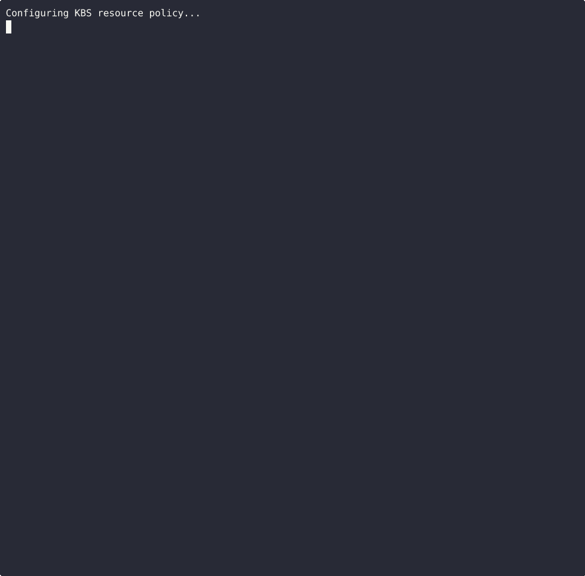
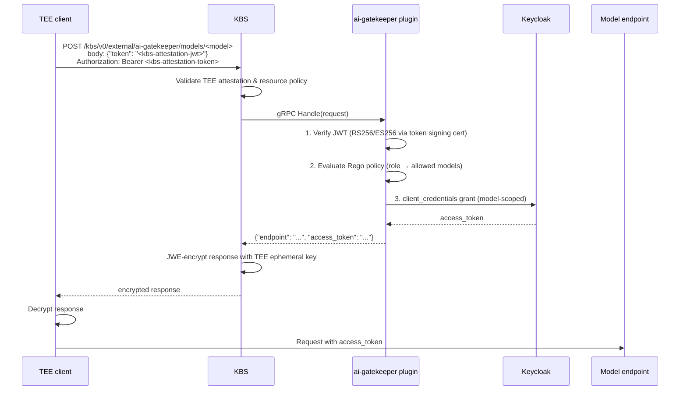

# AI Gatekeeper — KBS External Plugin

An external plugin for the [Trustee Key Broker Service (KBS)](https://github.com/confidential-containers/trustee) that gates access to AI model endpoints for TEE workloads inside Confidential Computing environments.

After attesting to KBS, a TEE workload calls this plugin to obtain a scoped access token and endpoint URL for a specific AI model. The plugin independently verifies the KBS-issued attestation JWT, evaluates a Rego policy against the JWT claims (supporting both role-based and measurement-based rules), and exchanges a Keycloak service account credential for a model-scoped token.

## Demo

The demo below shows a TEE workload attesting to KBS, receiving a Keycloak-issued access token scoped to a specific model through the encrypted KBS response, and calling the model endpoint directly with that token. It also shows the failure scenarios: policy deny, unknown model, tampered token, and wrong scope.



See [`demo/README.md`](demo/README.md) for how to run it locally.

## Request Flow



## Authentication Layers

Two independent layers protect each request:

1. **KBS attestation** — KBS verifies the client completed the RCAR handshake (real or sample TEE evidence). The plugin sets `validate_auth = false`, meaning KBS enforces this before forwarding.
2. **Plugin JWT** — the plugin independently verifies the KBS-issued attestation JWT from the request body, then evaluates the Rego policy against its claims.

## Configuration

The plugin reads a YAML config file. Set the path via `AI_GATEKEEPER_CONFIG` (default: `config.yaml`).

| Section | Purpose |
|---|---|
| `jwt_verification` | How to verify the KBS-issued attestation JWT presented by the client |
| `keycloak` | Service account credentials for fetching model-scoped tokens from Keycloak |
| `models` | Map of model names to their endpoint URL and Keycloak scope |
| `opa_url` | Base URL of the OPA HTTP server (run as a sidecar); the plugin POSTs to `<opa_url>/v1/data/ai_gatekeeper/allow` |
| `server` | gRPC listen address and optional TLS |

```yaml
jwt_verification:
  # KBS does not expose a JWKS endpoint. Distribute the KBS token signing cert
  # (token-cert-chain.pem from the KBS deployment) to the plugin.
  token_cert_path: "/run/secrets/kbs-token-cert-chain.pem"
  audience: "kbs"       # set to "" to skip audience check (insecure)
  leeway_seconds: 10    # tolerate up to N seconds of clock skew between KBS and plugin

keycloak:
  url: "https://keycloak:8080"
  realm: "ai-models"
  client_id: "ai-gatekeeper"
  client_secret_path: "/run/secrets/kc-secret"
  timeout_seconds: 10

models:
  llama-8b:
    endpoint: "https://llama-8b:8080"
    scope: "model:llama-8b"
  llama-70b:
    endpoint: "https://llama-70b:8080"
    scope: "model:llama-70b"

opa_url: "http://opa:8181"   # OPA runs as a sidecar HTTP server

server:
  address: "0.0.0.0:50051"
  # Optional TLS:
  # tls:
  #   cert: "/etc/ai-gatekeeper/server.crt"
  #   key: "/etc/ai-gatekeeper/server.key"
```

## Rego Policy

Policies are loaded into an OPA HTTP server (run as a sidecar). The plugin queries `POST /v1/data/ai_gatekeeper/allow` with the verified JWT claims and the requested model name as `input`:

```rego
package ai_gatekeeper

import rego.v1

default allow := false

allow if {
    allowed_models[input.claims.role][input.model]
}

# Measurement-based override for a specific TDX enclave.
allow if {
    input.claims.tee == "tdx"
    input.claims["td-attributes"].mr_td == "<mrtd>"
    allowed_models.research[input.model]
}

allowed_models := {
    "basic":    {"llama-8b":  true},
    "premium":  {"llama-8b":  true, "llama-70b": true},
    "research": {"llama-8b":  true, "llama-70b": true, "llama-405b": true},
}
```

## KBS Configuration

Register the plugin as an external backend in the KBS TOML config:

```toml
[[plugins]]
name = "external"
backends = [
  { name = "ai-gatekeeper", endpoint = "http://ai-gatekeeper:50051", tls_mode = "insecure", timeout_ms = 10000 },
]
```

The plugin is then reachable at `/kbs/v0/external/ai-gatekeeper/models/<model>`.

## Development

**Dependencies:** Python 3.12+, [OPA](https://www.openpolicyagent.org/docs/latest/#1-download-opa)

```bash
make install   # pip install -e ".[dev]"
make test      # pytest
```

**Docker:**

```bash
make build                    # build image (IMAGE=ai-gatekeeper)
make run CONFIG=... POLICY=... # run with mounted config and policy
```

## SDK

Built on [kbs-plugin-sdk-python](https://github.com/confidential-devhub/kbs-plugin-sdk-python). Implements `PluginHandler` with three methods:

| Method | Returns | Effect |
|---|---|---|
| `handle` | `PluginResponse` | Core request logic |
| `validate_auth` | `False` | KBS enforces TEE attestation before forwarding |
| `needs_encryption` | `True` | KBS JWE-encrypts the response with the TEE's ephemeral key |

## E2E Tests

The `e2e/` directory runs a full stack locally using Docker Compose: KBS (built from Trustee source with `EXTERNAL_PLUGIN=true`), the plugin, and a mock Keycloak.

```bash
make e2e   # from repo root — builds, runs all services, tests, tears down
```

Services:

| Service | Purpose |
|---|---|
| `setup` | Generates RSA key pair for test JWT signing and Keycloak secret |
| `mock-keycloak` | Returns `{"access_token": "mock-<scope>"}` on any token POST |
| `ai-gatekeeper` | Plugin under test (cert-based JWT verification in e2e) |
| `kbs` | KBS built from Trustee with `EXTERNAL_PLUGIN=true` |
| `test-runner` | Python image with PyJWT used for one-shot JWT generation |

**Note on error status codes:** KBS normalizes all non-2xx plugin responses to `401` before returning to the client (per [ext_plugin.md](https://github.com/confidential-containers/trustee/blob/main/kbs/docs/ext_plugin.md)). The e2e tests therefore check `200` for allowed access and `401` for all error cases (policy deny, unknown model, missing token). Specific status codes (`403`, `404`, `400`) are verified by unit tests and logged server-side by KBS.

E2e tests use a dedicated test RSA cert generated by the `setup` service rather than the real KBS token signing cert, keeping the test stack self-contained.
