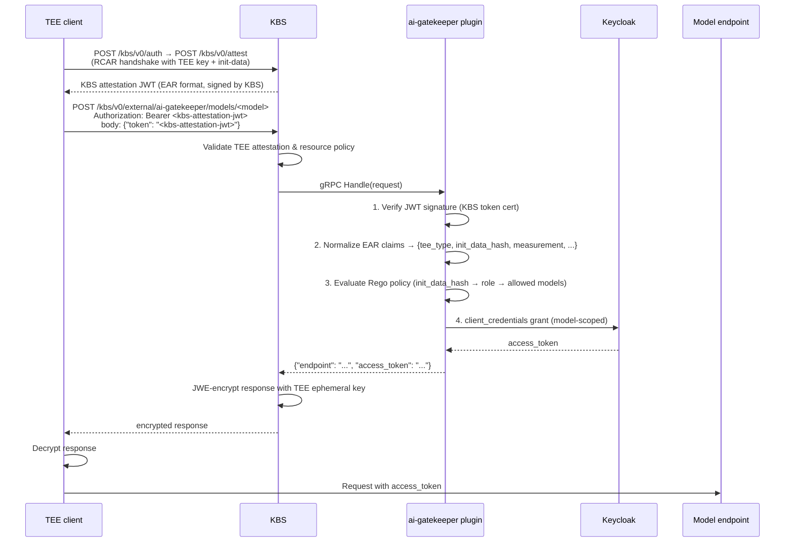

# EAR Claims Normalization and Init-Data Role Derivation Implementation Plan

> **For agentic workers:** REQUIRED SUB-SKILL: Use superpowers:subagent-driven-development (recommended) or superpowers:executing-plans to implement this plan task-by-task. Steps use checkbox (`- [ ]`) syntax for tracking.

**Goal:** Replace the self-signed `plugin-token.key` JWT body pattern with the real KBS EAR attestation JWT, normalizing EAR claims to a flat structure before Rego and deriving role from the init-data hash.

**Architecture:** A new `ear_normalizer.py` module flattens the nested EAR JWT payload (from `submods.cpu0["ear.veraison.annotated-evidence"]`) into a documented flat dict. The handler calls this after JWT verification and passes the result to Rego, which maps `init_data_hash` values to roles. Demo and e2e clients attest twice with different init-data strings and use the resulting KBS JWT as the body token directly.

**Tech Stack:** Python 3.12, PyJWT, OPA (Rego v1), kbs-client CLI (positional init-data argument), Docker Compose

---

## File Map

| File | Action | Responsibility |
|------|--------|---------------|
| `ai_gatekeeper/ear_normalizer.py` | Create | Flatten EAR JWT payload → operator-facing claims dict |
| `tests/test_ear_normalizer.py` | Create | Unit tests for normalizer |
| `ai_gatekeeper/handler.py` | Modify | Call normalizer after JWT verify; update subject logging |
| `tests/test_handler.py` | Modify | Use fake EAR dict; assert rego called with normalized claims |
| `policy.rego` | Modify | Derive role from `init_data_hash`; remove old `role`/`tee` claim paths |
| `demo/policy.rego` | Modify | Same as root policy with pre-computed demo hashes |
| `e2e/policy.rego` | Modify | Same as demo policy |
| `tests/test_policy.py` | Modify | Test with `init_data_hash`; update TDX test to use `tee_type`/`measurement` |
| `e2e/config/plugin-config.yaml` | Modify | `token_cert_path` → `/keys/token-cert-chain.pem` |
| `demo/config/plugin-config.yaml` | Modify | `token_cert_path` → `/keys/token-cert-chain.pem` |
| `e2e/docker-compose.yml` | Modify | Remove `plugin-token.key` generation; remove `test-runner` service |
| `demo/docker-compose.yml` | Modify | Remove `plugin-token.key` generation |
| `demo/demo-client.py` | Modify | Remove `make_plugin_jwt`; attest with init-data; body = KBS JWT |
| `e2e/tests/e2e.sh` | Modify | Two KBS attestations with init-data; body = KBS JWT |
| `e2e/Dockerfile.test-runner` | Delete | No longer needed |
| `DEPLOYMENT.md` | Create | Operator reference: claims, hash recipe, TEE guidance, hardening |
| `README.md` | Modify | Update flow diagram and Authentication Layers section |

---

## Task 1: EAR Normalizer — Tests

**Files:**
- Create: `tests/test_ear_normalizer.py`

- [ ] **Step 1: Write tests covering all normalizer behaviours**

```python
# tests/test_ear_normalizer.py
import pytest
from ai_gatekeeper.ear_normalizer import normalize_ear_claims

# ── helpers ──────────────────────────────────────────────────────────────────

def _ear(tee_type: str, tee_evidence: dict, *, init_data: str | None = None,
         ear_status: str = "affirming") -> dict:
    """Build a minimal EAR JWT payload dict for the given TEE type."""
    annotated = {tee_type: tee_evidence}
    if init_data is not None:
        annotated["init_data"] = init_data
    return {
        "submods": {
            "cpu0": {
                "ear.status": ear_status,
                "ear.veraison.annotated-evidence": annotated,
            }
        }
    }


# ── sample TEE ───────────────────────────────────────────────────────────────

def test_sample_tee_type():
    ear = _ear("sample", {"launch_digest": "abcde", "debug": False})
    result = normalize_ear_claims(ear)
    assert result["tee_type"] == "sample"


def test_sample_measurement_is_launch_digest():
    ear = _ear("sample", {"launch_digest": "abcde", "debug": False})
    result = normalize_ear_claims(ear)
    assert result["measurement"] == "abcde"


def test_sample_debug_flag():
    ear = _ear("sample", {"launch_digest": "abcde", "debug": True})
    result = normalize_ear_claims(ear)
    assert result["debug"] is True


def test_ear_status_propagated():
    ear = _ear("sample", {"launch_digest": "abcde", "debug": False},
               ear_status="warning")
    result = normalize_ear_claims(ear)
    assert result["ear_status"] == "warning"


def test_init_data_hash_present():
    ear = _ear("sample", {"launch_digest": "abcde", "debug": False},
               init_data="IWjlrrHiZjz0SmFAWXDdSbqZcnLytZIOVGNgYJzv4b8")
    result = normalize_ear_claims(ear)
    assert result["init_data_hash"] == "IWjlrrHiZjz0SmFAWXDdSbqZcnLytZIOVGNgYJzv4b8"


def test_init_data_hash_absent_is_none():
    ear = _ear("sample", {"launch_digest": "abcde", "debug": False})
    result = normalize_ear_claims(ear)
    assert result["init_data_hash"] is None


def test_debug_absent_is_none():
    ear = _ear("sample", {"launch_digest": "abcde"})
    result = normalize_ear_claims(ear)
    assert result["debug"] is None


# ── tdx TEE ──────────────────────────────────────────────────────────────────

def test_tdx_tee_type():
    ear = _ear("tdx", {"mr_td": "deadbeef", "debug": False})
    result = normalize_ear_claims(ear)
    assert result["tee_type"] == "tdx"


def test_tdx_measurement_is_mr_td():
    ear = _ear("tdx", {"mr_td": "deadbeef", "debug": False})
    result = normalize_ear_claims(ear)
    assert result["measurement"] == "deadbeef"


# ── snp TEE ──────────────────────────────────────────────────────────────────

def test_snp_measurement_is_measurement_field():
    ear = _ear("snp", {"measurement": "cafebabe"})
    result = normalize_ear_claims(ear)
    assert result["tee_type"] == "snp"
    assert result["measurement"] == "cafebabe"


# ── excluded keys not treated as TEE type ────────────────────────────────────

def test_excluded_keys_not_detected_as_tee():
    # annotated-evidence contains only shared/excluded keys — no TEE sub-object
    ear = {
        "submods": {
            "cpu0": {
                "ear.status": "affirming",
                "ear.veraison.annotated-evidence": {
                    "report_data": "xyz",
                    "init_data": "abc",
                    "init_data_claims": {},
                    "runtime_data_claims": {},
                }
            }
        }
    }
    result = normalize_ear_claims(ear)
    assert result["tee_type"] is None
    assert result["measurement"] is None


# ── graceful degradation ──────────────────────────────────────────────────────

def test_empty_dict_returns_all_none():
    result = normalize_ear_claims({})
    assert result == {
        "tee_type": None,
        "ear_status": None,
        "init_data_hash": None,
        "measurement": None,
        "debug": None,
    }


def test_malformed_submods_returns_all_none():
    result = normalize_ear_claims({"submods": "not-a-dict"})
    assert result == {
        "tee_type": None,
        "ear_status": None,
        "init_data_hash": None,
        "measurement": None,
        "debug": None,
    }
```

- [ ] **Step 2: Run tests — expect ImportError (module does not exist yet)**

```bash
cd /home/ubuntu/ai-gatekeeper-kbs-plugin && .venv/bin/pytest tests/test_ear_normalizer.py -v 2>&1 | head -20
```

Expected: `ImportError: cannot import name 'normalize_ear_claims'`

---

## Task 2: EAR Normalizer — Implementation

**Files:**
- Create: `ai_gatekeeper/ear_normalizer.py`

- [ ] **Step 1: Implement the normalizer**

```python
# ai_gatekeeper/ear_normalizer.py
"""
EAR (Entity Attestation Result) JWT claim normalizer.

The KBS attestation service produces JWTs in EAR format (eat_profile:
"tag:github.com,2024:confidential-containers/Trustee"). This module
extracts the attestation-relevant fields and exposes them under a flat,
stable interface that Rego policies can query without knowing the EAR
structure.

Normalized output fields (the operator contract):
  tee_type        str | None  TEE platform: "sample" | "tdx" | "snp" | "sgx" | ...
  ear_status      str | None  EAR verdict: "affirming" | "warning" | "contraindicated"
  init_data_hash  str | None  base64url SHA-256 of the init-data blob passed at
                              attestation time; None if not provided.
                              On real hardware (TDX/SNP) this hash is
                              cryptographically bound to the TEE evidence.
  measurement     str | None  Primary measurement register, TEE-type-specific:
                                sample → launch_digest
                                tdx    → mr_td   (verify path against real TDX EAR)
                                snp    → measurement
                                sgx    → mrenclave
                              None for unknown TEE types.
  debug           bool | None debug mode flag from TEE evidence; None if absent.

All fields default to None on parse error — a malformed EAR payload causes
deny (no init_data_hash matches any role_map entry in Rego).
"""

_EXCLUDED_EVIDENCE_KEYS = frozenset({
    "report_data",
    "init_data",
    "init_data_claims",
    "runtime_data_claims",
})

# Maps TEE type name → field name for the primary measurement register.
# Add entries here as new TEE types are validated against real EAR output.
_MEASUREMENT_KEY: dict[str, str] = {
    "sample": "launch_digest",
    "tdx": "mr_td",        # verify against a live TDX EAR token
    "snp": "measurement",
    "sgx": "mrenclave",
}


def normalize_ear_claims(ear_claims: dict) -> dict:
    """Return a flat claims dict from a raw EAR JWT payload."""
    _empty = {
        "tee_type": None,
        "ear_status": None,
        "init_data_hash": None,
        "measurement": None,
        "debug": None,
    }
    try:
        cpu0 = ear_claims.get("submods", {}).get("cpu0", {})
        if not isinstance(cpu0, dict):
            return _empty

        evidence = cpu0.get("ear.veraison.annotated-evidence", {})
        if not isinstance(evidence, dict):
            return _empty

        tee_type = next(
            (k for k in evidence if k not in _EXCLUDED_EVIDENCE_KEYS),
            None,
        )

        tee_ev = evidence.get(tee_type, {}) if tee_type else {}
        measurement_key = _MEASUREMENT_KEY.get(tee_type) if tee_type else None

        return {
            "tee_type": tee_type,
            "ear_status": cpu0.get("ear.status"),
            "init_data_hash": evidence.get("init_data"),
            "measurement": tee_ev.get(measurement_key) if measurement_key else None,
            "debug": tee_ev.get("debug"),
        }
    except Exception:
        return _empty
```

- [ ] **Step 2: Run tests — expect all pass**

```bash
cd /home/ubuntu/ai-gatekeeper-kbs-plugin && .venv/bin/pytest tests/test_ear_normalizer.py -v
```

Expected: all tests PASS.

- [ ] **Step 3: Commit**

```bash
cd /home/ubuntu/ai-gatekeeper-kbs-plugin
git add ai_gatekeeper/ear_normalizer.py tests/test_ear_normalizer.py
git commit -m "feat: add EAR JWT claim normalizer with tests"
```

---

## Task 3: Update Handler — Tests First

**Files:**
- Modify: `tests/test_handler.py`

The handler will call `normalize_ear_claims(claims)` after JWT verification and pass the result to Rego. Tests must reflect this: the verifier returns a fake EAR dict, the real normalizer runs on it, and Rego is asserted to receive the normalized result.

- [ ] **Step 1: Replace `tests/test_handler.py` with the updated version**

```python
# tests/test_handler.py
import json
from unittest.mock import AsyncMock, MagicMock

import pytest
from kbs_plugin_sdk.plugin.plugin_pb2 import (
    NeedsEncryptionRequest,
    PluginRequest,
    ValidateAuthRequest,
)

from ai_gatekeeper.config import ModelConfig
from ai_gatekeeper.handler import GatekeeperHandler

# Minimal EAR JWT payload that normalize_ear_claims can process.
_FAKE_EAR = {
    "submods": {
        "cpu0": {
            "ear.status": "affirming",
            "ear.veraison.annotated-evidence": {
                "sample": {"launch_digest": "abcde", "debug": False},
                "init_data": "IWjlrrHiZjz0SmFAWXDdSbqZcnLytZIOVGNgYJzv4b8",
            },
        }
    }
}

# What normalize_ear_claims produces from _FAKE_EAR.
_NORMALIZED = {
    "tee_type": "sample",
    "ear_status": "affirming",
    "init_data_hash": "IWjlrrHiZjz0SmFAWXDdSbqZcnLytZIOVGNgYJzv4b8",
    "measurement": "abcde",
    "debug": False,
}


def _handler(*, allow=True, token_valid=True, kc_token="tok"):
    cfg = MagicMock()
    cfg.models = {
        "llama-8b": ModelConfig(endpoint="https://llama-8b/", scope="model:llama-8b")
    }

    verifier = MagicMock()
    if token_valid:
        verifier.verify.return_value = _FAKE_EAR
    else:
        verifier.verify.side_effect = Exception("invalid token")

    rego = MagicMock()
    rego.allow = AsyncMock(return_value=allow)

    kc = MagicMock()
    kc.get_token = AsyncMock(return_value=kc_token)

    return GatekeeperHandler(cfg, verifier, rego, kc)


def _request(model: str, body: bytes | None = None) -> PluginRequest:
    if body is None:
        body = json.dumps({"token": "jwt"}).encode()
    return PluginRequest(body=body, path=["models", model], method="POST")


@pytest.mark.asyncio
async def test_allowed_returns_endpoint_and_token():
    h = _handler()
    resp = await h.handle(_request("llama-8b"))
    assert resp.status_code == 200
    body = json.loads(resp.body)
    assert body["access_token"] == "tok"
    assert body["endpoint"] == "https://llama-8b/"
    h._verifier.verify.assert_called_once_with("jwt")
    # rego receives the normalized EAR claims, not the raw EAR payload
    h._rego.allow.assert_awaited_once_with(_NORMALIZED, "llama-8b")
    h._kc.get_token.assert_awaited_once_with("model:llama-8b")


@pytest.mark.asyncio
async def test_invalid_token_returns_401():
    h = _handler(token_valid=False)
    resp = await h.handle(_request("llama-8b"))
    assert resp.status_code == 401
    h._verifier.verify.assert_called_once_with("jwt")
    h._rego.allow.assert_not_awaited()
    h._kc.get_token.assert_not_awaited()


@pytest.mark.asyncio
async def test_policy_deny_returns_403():
    h = _handler(allow=False)
    resp = await h.handle(_request("llama-8b"))
    assert resp.status_code == 403
    h._rego.allow.assert_awaited_once_with(_NORMALIZED, "llama-8b")
    h._kc.get_token.assert_not_awaited()


@pytest.mark.asyncio
async def test_unknown_model_returns_404():
    h = _handler()
    resp = await h.handle(_request("llama-405b"))
    assert resp.status_code == 404
    h._rego.allow.assert_awaited_once_with(_NORMALIZED, "llama-405b")
    h._kc.get_token.assert_not_awaited()


@pytest.mark.asyncio
async def test_missing_token_returns_400():
    h = _handler()
    req = PluginRequest(body=b"{}", path=["models", "llama-8b"], method="POST")
    resp = await h.handle(req)
    assert resp.status_code == 400
    h._verifier.verify.assert_not_called()
    h._rego.allow.assert_not_awaited()


@pytest.mark.asyncio
async def test_bad_json_returns_400():
    h = _handler()
    req = PluginRequest(body=b"not-json", path=["models", "llama-8b"], method="POST")
    resp = await h.handle(req)
    assert resp.status_code == 400
    h._verifier.verify.assert_not_called()
    h._rego.allow.assert_not_awaited()


@pytest.mark.asyncio
async def test_keycloak_failure_returns_502():
    h = _handler()
    h._kc.get_token = AsyncMock(side_effect=Exception("kc down"))
    resp = await h.handle(_request("llama-8b"))
    assert resp.status_code == 502
    h._rego.allow.assert_awaited_once_with(_NORMALIZED, "llama-8b")
    h._kc.get_token.assert_awaited_once_with("model:llama-8b")


@pytest.mark.asyncio
async def test_missing_model_in_path_returns_400():
    h = _handler()
    req = PluginRequest(body=json.dumps({"token": "jwt"}).encode(), path=["models"], method="POST")
    resp = await h.handle(req)
    assert resp.status_code == 400
    h._verifier.verify.assert_not_called()
    h._rego.allow.assert_not_awaited()


@pytest.mark.asyncio
async def test_validate_auth_returns_false():
    assert await _handler().validate_auth(ValidateAuthRequest()) is False


@pytest.mark.asyncio
async def test_needs_encryption_returns_true():
    assert await _handler().needs_encryption(NeedsEncryptionRequest()) is True
```

- [ ] **Step 2: Run the handler tests — expect failures on `test_allowed_*` and `test_policy_deny` and `test_unknown_model` and `test_keycloak_failure`**

```bash
cd /home/ubuntu/ai-gatekeeper-kbs-plugin && .venv/bin/pytest tests/test_handler.py -v
```

Expected: tests that assert `rego.allow` was called with `_NORMALIZED` will fail because the handler still passes raw claims.

---

## Task 4: Update Handler — Implementation

**Files:**
- Modify: `ai_gatekeeper/handler.py`

- [ ] **Step 1: Update handler to call normalizer**

Replace the full content of `ai_gatekeeper/handler.py`:

```python
import json
import logging

from kbs_plugin_sdk import (
    PluginHandler,
    PluginRequest,
    PluginResponse,
)

from ai_gatekeeper.config import Config
from ai_gatekeeper.ear_normalizer import normalize_ear_claims
from ai_gatekeeper.jwt_verifier import JwtVerifier
from ai_gatekeeper.keycloak_client import KeycloakClient
from ai_gatekeeper.rego_evaluator import RegoEvaluator

logger = logging.getLogger(__name__)


class GatekeeperHandler(PluginHandler):
    def __init__(
        self,
        config: Config,
        verifier: JwtVerifier,
        rego: RegoEvaluator,
        kc: KeycloakClient,
    ) -> None:
        self._config = config
        self._verifier = verifier
        self._rego = rego
        self._kc = kc

    async def handle(self, request: PluginRequest) -> PluginResponse:
        if len(request.path) < 2 or not request.path[1]:
            logger.warning("rejected: missing model in path")
            return PluginResponse(body=b"missing model in path", status_code=400)

        model_name = request.path[1]

        try:
            body = json.loads(request.body)
            token = body["token"]
        except (json.JSONDecodeError, KeyError):
            logger.warning("model=%s rejected: missing or malformed token field", model_name)
            return PluginResponse(body=b"missing token", status_code=400)

        try:
            ear_claims = self._verifier.verify(token)
        except Exception as exc:
            logger.warning("model=%s rejected: token verification failed: %s", model_name, exc)
            return PluginResponse(body=b"invalid token", status_code=401)

        # Flatten EAR structure into the documented operator-facing claims dict.
        # Rego policy receives only these fields — see ear_normalizer.py for the
        # full field reference and TEE-type-specific source paths.
        normalized = normalize_ear_claims(ear_claims)
        subject = normalized.get("tee_type") or "<unknown-tee>"

        if not await self._rego.allow(normalized, model_name):
            logger.info("decision=deny tee=%s model=%s reason=policy", subject, model_name)
            return PluginResponse(body=b"access denied", status_code=403)

        model = self._config.models.get(model_name)
        if model is None:
            logger.warning(
                "decision=deny tee=%s model=%s reason=unknown-model (policy allowed but model not in config)",
                subject, model_name,
            )
            return PluginResponse(body=b"unknown model", status_code=404)

        try:
            access_token = await self._kc.get_token(model.scope)
        except Exception as exc:
            logger.error("decision=error tee=%s model=%s reason=upstream: %s", subject, model_name, exc)
            return PluginResponse(body=b"upstream error", status_code=502)

        logger.info("decision=allow tee=%s model=%s endpoint=%s", subject, model_name, model.endpoint)
        out = json.dumps({"endpoint": model.endpoint, "access_token": access_token})
        return PluginResponse(body=out.encode(), status_code=200)
```

- [ ] **Step 2: Run handler tests — expect all pass**

```bash
cd /home/ubuntu/ai-gatekeeper-kbs-plugin && .venv/bin/pytest tests/test_handler.py -v
```

Expected: all tests PASS.

- [ ] **Step 3: Run full test suite to check for regressions**

```bash
cd /home/ubuntu/ai-gatekeeper-kbs-plugin && .venv/bin/pytest -v
```

Expected: all existing tests pass (policy tests may fail — addressed in Task 5).

- [ ] **Step 4: Commit**

```bash
cd /home/ubuntu/ai-gatekeeper-kbs-plugin
git add ai_gatekeeper/handler.py tests/test_handler.py
git commit -m "feat: normalize EAR claims before Rego evaluation"
```

---

## Task 5: Update Rego Policies

**Files:**
- Modify: `policy.rego`
- Modify: `demo/policy.rego`
- Modify: `e2e/policy.rego`

The hashes below are pre-computed:
- `'{"role":"basic"}'`   → `IWjlrrHiZjz0SmFAWXDdSbqZcnLytZIOVGNgYJzv4b8`
- `'{"role":"premium"}'` → `IpkBARc5Qjrihj0OgyegL4oTF-uuWVyAvtv8swX6Kv4`

Verify them yourself:
```bash
printf '{"role":"basic"}' | sha256sum | awk '{print $1}' | xxd -r -p | base64 | tr '+/' '-_' | tr -d '='
printf '{"role":"premium"}' | sha256sum | awk '{print $1}' | xxd -r -p | base64 | tr '+/' '-_' | tr -d '='
```

- [ ] **Step 1: Replace `policy.rego`**

```rego
package ai_gatekeeper

import rego.v1

default allow := false

# Role map: base64url(sha256(init-data-string)) → role name.
#
# Compute a hash with:
#   printf '<init-data-string>' | sha256sum | awk '{print $1}' \
#     | xxd -r -p | base64 | tr '+/' '-_' | tr -d '='
#
# On real hardware (TDX/SNP), init-data is cryptographically measured and
# bound to the TEE evidence — these hashes cannot be forged by the workload.
# See DEPLOYMENT.md for per-TEE-type configuration guidance.
role_map := {
    "IWjlrrHiZjz0SmFAWXDdSbqZcnLytZIOVGNgYJzv4b8": "basic",    # sha256('{"role":"basic"}')
    "IpkBARc5Qjrihj0OgyegL4oTF-uuWVyAvtv8swX6Kv4": "premium",  # sha256('{"role":"premium"}')
}

role := r if { r := role_map[input.claims.init_data_hash] }

allow if {
    allowed_models[role][input.model]
}

# Measurement-based override: a specific TDX enclave gets research access
# regardless of init-data. Replace with your enclave's mr_td value.
allow if {
    input.claims.tee_type == "tdx"
    input.claims.measurement == "replace-with-your-mr-td"
    allowed_models.research[input.model]
}

allowed_models := {
    "basic":    {"llama-8b":  true},
    "premium":  {"llama-8b":  true, "llama-70b": true},
    "research": {"llama-8b":  true, "llama-70b": true},
}
```

- [ ] **Step 2: Replace `demo/policy.rego`** (identical to root policy)

Copy the exact same content as Step 1 into `demo/policy.rego`.

- [ ] **Step 3: Replace `e2e/policy.rego`** (identical to root policy)

Copy the exact same content as Step 1 into `e2e/policy.rego`.

- [ ] **Step 4: Commit**

```bash
cd /home/ubuntu/ai-gatekeeper-kbs-plugin
git add policy.rego demo/policy.rego e2e/policy.rego
git commit -m "feat: derive role from init_data_hash in Rego policy"
```

---

## Task 6: Update Policy Unit Tests

**Files:**
- Modify: `tests/test_policy.py`

Tests now send `init_data_hash` instead of `role`. The TDX override now checks `tee_type` and `measurement` instead of `tee` and `td-attributes.mr_td`.

- [ ] **Step 1: Replace `tests/test_policy.py`**

```python
"""
Tests for policy.rego using a real OPA subprocess.

These tests run `opa eval` against the actual policy file so that any change
to policy.rego is immediately caught.  They are skipped automatically if the
`opa` binary is not on PATH (e.g. in environments where only the OPA HTTP
sidecar is used).
"""

import json
import shutil
import subprocess
from pathlib import Path

import pytest

POLICY = Path(__file__).parent.parent / "policy.rego"

pytestmark = pytest.mark.skipif(
    shutil.which("opa") is None, reason="opa binary not found"
)

# Pre-computed hashes matching the role_map in policy.rego.
# Verify: printf '<string>' | sha256sum | awk '{print $1}' | xxd -r -p | base64 | tr '+/' '-_' | tr -d '='
BASIC_HASH = "IWjlrrHiZjz0SmFAWXDdSbqZcnLytZIOVGNgYJzv4b8"    # sha256('{"role":"basic"}')
PREMIUM_HASH = "IpkBARc5Qjrihj0OgyegL4oTF-uuWVyAvtv8swX6Kv4"  # sha256('{"role":"premium"}')


def _allow(claims: dict, model: str) -> bool:
    result = subprocess.run(
        [
            "opa", "eval",
            "--data", str(POLICY),
            "--input", "/dev/stdin",
            "--format", "raw",
            "data.ai_gatekeeper.allow",
        ],
        input=json.dumps({"claims": claims, "model": model}).encode(),
        capture_output=True,
        timeout=5,
    )
    return result.stdout.strip() == b"true"


# ── init-data hash role derivation ───────────────────────────────────────────

def test_basic_hash_allows_llama8b():
    assert _allow({"init_data_hash": BASIC_HASH}, "llama-8b") is True


def test_basic_hash_denies_llama70b():
    assert _allow({"init_data_hash": BASIC_HASH}, "llama-70b") is False


def test_premium_hash_allows_llama8b():
    assert _allow({"init_data_hash": PREMIUM_HASH}, "llama-8b") is True


def test_premium_hash_allows_llama70b():
    assert _allow({"init_data_hash": PREMIUM_HASH}, "llama-70b") is True


def test_unknown_hash_denied():
    assert _allow({"init_data_hash": "not-a-known-hash"}, "llama-8b") is False


def test_missing_init_data_hash_denied():
    assert _allow({}, "llama-8b") is False


def test_any_hash_denies_unconfigured_model():
    assert _allow({"init_data_hash": PREMIUM_HASH}, "llama-405b") is False


def test_default_deny_with_empty_input():
    assert _allow({}, "") is False


# ── TDX measurement override ─────────────────────────────────────────────────

def test_tdx_correct_measurement_allows_research_model():
    # The placeholder measurement in policy.rego grants research-level access.
    # In production this value is replaced with the real enclave mr_td.
    claims = {
        "tee_type": "tdx",
        "measurement": "replace-with-your-mr-td",
    }
    assert _allow(claims, "llama-70b") is True


def test_tdx_wrong_measurement_denied():
    claims = {
        "tee_type": "tdx",
        "measurement": "wrong-measurement",
    }
    assert _allow(claims, "llama-70b") is False


def test_tdx_correct_measurement_denies_unconfigured_model():
    claims = {
        "tee_type": "tdx",
        "measurement": "replace-with-your-mr-td",
    }
    assert _allow(claims, "llama-405b") is False


def test_tdx_rule_requires_tee_type_claim():
    # Correct measurement but no tee_type=tdx must not trigger the TDX override.
    claims = {"measurement": "replace-with-your-mr-td"}
    assert _allow(claims, "llama-70b") is False
```

- [ ] **Step 2: Run policy tests**

```bash
cd /home/ubuntu/ai-gatekeeper-kbs-plugin && .venv/bin/pytest tests/test_policy.py -v
```

Expected: all tests PASS (skip if `opa` not on PATH).

- [ ] **Step 3: Run full test suite**

```bash
cd /home/ubuntu/ai-gatekeeper-kbs-plugin && .venv/bin/pytest -v
```

Expected: all tests PASS.

- [ ] **Step 4: Commit**

```bash
cd /home/ubuntu/ai-gatekeeper-kbs-plugin
git add tests/test_policy.py
git commit -m "test: update policy tests to use init_data_hash and normalized EAR claims"
```

---

## Task 7: Update Config Files

**Files:**
- Modify: `e2e/config/plugin-config.yaml`
- Modify: `demo/config/plugin-config.yaml`

- [ ] **Step 1: Update `e2e/config/plugin-config.yaml`**

Change `token_cert_path` from `/keys/plugin-token-cert.pem` to `/keys/token-cert-chain.pem` and add audience comment:

```yaml
jwt_verification:
  token_cert_path: /keys/token-cert-chain.pem
  audience: ""  # set to your KBS issuer URL in production
  leeway_seconds: 10

keycloak:
  url: http://mock-keycloak:8080
  realm: ai-models
  client_id: ai-gatekeeper
  client_secret_path: /keys/kc-secret
  timeout_seconds: 10

models:
  llama-8b:
    endpoint: https://llama-8b:8080
    scope: llama-8b
  llama-70b:
    endpoint: https://llama-70b:8080
    scope: llama-70b

opa_url: "http://opa:8181"

server:
  address: 0.0.0.0:50051
```

- [ ] **Step 2: Update `demo/config/plugin-config.yaml`**

```yaml
jwt_verification:
  token_cert_path: /keys/token-cert-chain.pem
  audience: ""  # set to your KBS issuer URL in production
  leeway_seconds: 10

keycloak:
  url: http://keycloak:8080
  realm: ai-models
  client_id: ai-gatekeeper
  client_secret_path: /run/secrets/kc-secret
  timeout_seconds: 10

models:
  llama-8b:
    endpoint: "http://llama-8b:8080"
    scope: llama-8b
  llama-70b:
    endpoint: "http://llama-70b:8080"
    scope: llama-70b

opa_url: "http://opa:8181"

server:
  address: 0.0.0.0:50051
```

- [ ] **Step 3: Commit**

```bash
cd /home/ubuntu/ai-gatekeeper-kbs-plugin
git add e2e/config/plugin-config.yaml demo/config/plugin-config.yaml
git commit -m "config: point token_cert_path to KBS token-cert-chain.pem"
```

---

## Task 8: Remove plugin-token.key from Docker Compose Setup

**Files:**
- Modify: `e2e/docker-compose.yml`
- Modify: `demo/docker-compose.yml`
- Delete: `e2e/Dockerfile.test-runner`

- [ ] **Step 1: Update `e2e/docker-compose.yml` setup service and remove test-runner**

Remove the `plugin-token.key` block from the `setup` service command and delete the entire `test-runner` service. The updated `setup` service command becomes:

```yaml
  setup:
    image: alpine/openssl
    entrypoint: /bin/ash
    command: >
      -c "
        cd /keys
        if [ ! -s token.key ]; then
          openssl genrsa -traditional -out ca.key 2048
          openssl req -new -key ca.key -out ca-req.csr -subj '/O=Test/OU=e2e/CN=test-root'
          openssl req -x509 -days 3650 -key ca.key -in ca-req.csr -out ca-cert.pem
          openssl ecparam -name prime256v1 -genkey -noout -out token.key
          openssl req -new -key token.key -out token-req.csr -subj '/O=Test/OU=e2e/CN=test-as'
          openssl x509 -req -in token-req.csr -CA ca-cert.pem -CAkey ca.key -CAcreateserial -out token-cert.pem
          cat token-cert.pem ca-cert.pem > token-cert-chain.pem
        fi
        if [ ! -s tee.key ]; then
          openssl genpkey -algorithm EC -pkeyopt ec_paramgen_curve:P-256 -out tee.key
        fi
        if [ ! -s kc-secret ]; then
          printf 'test-secret' > kc-secret
        fi"
    volumes:
      - keys:/keys
```

Remove the entire `test-runner` service block (was only used for JWT generation).

- [ ] **Step 2: Update `demo/docker-compose.yml` setup service**

Remove the `plugin-token.key` block from the `setup` service command:

```yaml
  setup:
    image: alpine/openssl
    entrypoint: /bin/ash
    command: >
      -c "
        cd /keys
        if [ ! -s token.key ]; then
          openssl genrsa -traditional -out ca.key 2048
          openssl req -new -key ca.key -out ca-req.csr -subj '/O=Demo/OU=demo/CN=demo-root'
          openssl req -x509 -days 3650 -key ca.key -in ca-req.csr -out ca-cert.pem
          openssl ecparam -name prime256v1 -genkey -noout -out token.key
          openssl req -new -key token.key -out token-req.csr -subj '/O=Demo/OU=demo/CN=demo-as'
          openssl x509 -req -in token-req.csr -CA ca-cert.pem -CAkey ca.key -CAcreateserial -out token-cert.pem
          cat token-cert.pem ca-cert.pem > token-cert-chain.pem
        fi
        if [ ! -s tee.key ]; then
          openssl genpkey -algorithm EC -pkeyopt ec_paramgen_curve:P-256 -out tee.key
        fi"
    volumes:
      - keys:/keys
```

- [ ] **Step 3: Delete `e2e/Dockerfile.test-runner`**

```bash
rm /home/ubuntu/ai-gatekeeper-kbs-plugin/e2e/Dockerfile.test-runner
```

- [ ] **Step 4: Check `e2e/Makefile` for test-runner references and remove any**

```bash
grep -n "test-runner" /home/ubuntu/ai-gatekeeper-kbs-plugin/e2e/Makefile
```

Remove any `test-runner` build or run targets found.

- [ ] **Step 5: Commit**

```bash
cd /home/ubuntu/ai-gatekeeper-kbs-plugin
git add e2e/docker-compose.yml demo/docker-compose.yml e2e/Makefile
git rm e2e/Dockerfile.test-runner
git commit -m "chore: remove plugin-token.key and test-runner JWT generation"
```

---

## Task 9: Update Demo Client

**Files:**
- Modify: `demo/demo-client.py`

- [ ] **Step 1: Replace `demo/demo-client.py`**

```python
#!/usr/bin/env python3
"""
Demo client — full TEE workload journey:
  attest (with init-data) → obtain scoped credentials → call model endpoint

The body token sent to the plugin IS the KBS attestation JWT — the same token
used as the Bearer. No separate signing key is involved. Role is derived inside
the plugin from the init_data_hash claim in the EAR attestation JWT.

Runs six scenarios (happy paths + failure cases) against a live demo stack.
"""
import json
import subprocess
import time

import httpx
import jwt as pyjwt
from jwcrypto import jwe as jwejwe
from jwcrypto import jwk

KBS_URL = "http://kbs:8080"
TEE_KEY_PATH = "/keys/tee.key"

SEP = "━" * 50


def setup_kbs_policy() -> None:
    import base64
    policy = b"package policy\ndefault allow = true"
    encoded = base64.urlsafe_b64encode(policy).rstrip(b"=").decode()
    with httpx.Client(timeout=10) as client:
        r = client.post(
            f"{KBS_URL}/kbs/v0/resource-policy",
            json={"policy": encoded},
            headers={"Authorization": "Bearer dev-token"},
        )
        r.raise_for_status()
    print("  KBS resource policy set (allow-all).")


def banner(title: str) -> None:
    print(f"\n{SEP}\n{title}\n{SEP}")


def attest(init_data: str | None = None) -> str:
    """
    Run kbs-client attest and return the KBS attestation JWT.

    init_data is passed as a positional argument to kbs-client. Its SHA-256
    hash is included in the EAR JWT as the init_data_hash claim. On real
    hardware (TDX/SNP) this hash is cryptographically bound to the TEE
    evidence — the workload cannot forge a different hash after launch.
    The plugin's Rego policy maps known hashes to roles (see policy.rego).
    """
    cmd = ["kbs-client", "--url", KBS_URL, "attest", "--tee-key-file", TEE_KEY_PATH]
    if init_data is not None:
        cmd.append(init_data)
    result = subprocess.run(cmd, capture_output=True, text=True, check=True)
    token = result.stdout.strip()
    label = f" (init-data={init_data!r})" if init_data else ""
    print(f"  KBS attestation token{label}: {token[:40]}...")
    print(f"  (proves TEE completed RCAR handshake; sent as Bearer and body token)")
    return token


def call_plugin(model: str, kbs_token: str, tee_key) -> tuple[int, dict | None]:
    """
    Call the AI gatekeeper plugin via KBS.

    The KBS attestation JWT is used both as the Bearer token (KBS validates
    TEE attestation) and as the body token (plugin verifies and normalizes
    EAR claims, derives role from init_data_hash, fetches Keycloak token).
    """
    url = f"{KBS_URL}/kbs/v0/external/ai-gatekeeper/models/{model}"
    print(f"  Plugin call : POST /kbs/v0/external/ai-gatekeeper/models/{model}")
    with httpx.Client(timeout=15) as client:
        r = client.post(
            url,
            json={"token": kbs_token},
            headers={"Authorization": f"Bearer {kbs_token}"},
        )
    if r.status_code != 200:
        print(f"  Plugin      : {r.status_code}  {r.text.strip()}")
        return r.status_code, None
    tok = jwejwe.JWE()
    tok.deserialize(r.text.strip(), tee_key)
    payload = json.loads(tok.payload)
    kc_claims = pyjwt.decode(payload["access_token"], options={"verify_signature": False})
    kc_scope = kc_claims.get("scope", "(no scope claim)")
    print(f"  Plugin      : 200 OK (JWE-encrypted response, decrypted with TEE private key)")
    print(f"  Endpoint    : {payload['endpoint']}")
    print(f"  KC token    : {payload['access_token'][:40]}...")
    print(f"  (Keycloak access token issued to this TEE; scope={kc_scope!r})")
    return 200, payload


def call_model(endpoint: str, access_token: str) -> tuple[int, str]:
    url = f"{endpoint}/v1/chat/completions"
    print(f"  Model call  : POST {url}")
    print(f"  (using Keycloak access token as Bearer; model validates via JWKS)")
    with httpx.Client(timeout=10) as client:
        r = client.post(
            url,
            json={"model": "demo", "messages": [{"role": "user", "content": "Hello"}]},
            headers={"Authorization": f"Bearer {access_token}"},
        )
    if r.status_code == 200:
        content = r.json()["choices"][0]["message"]["content"]
        print(f"  Model       : 200 OK  \"{content}\"")
    else:
        print(f"  Model       : {r.status_code}  {r.text.strip()}")
    return r.status_code, r.text


def show_result(ok: bool) -> None:
    print(f"  Result      : {'PASS' if ok else 'FAIL'}")


def main() -> None:
    print("Configuring KBS resource policy...")
    setup_kbs_policy()

    print("Loading TEE key...")
    with open(TEE_KEY_PATH, "rb") as f:
        tee_key = jwk.JWK.from_pem(f.read())

    print("Attesting with init-data to establish roles...")
    kbs_token_basic = attest(init_data='{"role":"basic"}')
    kbs_token_premium = attest(init_data='{"role":"premium"}')

    token_70b = None
    token_8b = None

    # ── Scenario 1: premium init-data → llama-70b ─────────────────────────────
    banner("Scenario 1: Happy path — premium init-data → llama-70b")
    status, payload = call_plugin("llama-70b", kbs_token_premium, tee_key)
    if payload:
        model_status, _ = call_model(payload["endpoint"], payload["access_token"])
        show_result(model_status == 200)
        token_70b = payload["access_token"]
    else:
        show_result(False)

    # ── Scenario 2: basic init-data → llama-8b ────────────────────────────────
    banner("Scenario 2: Happy path — basic init-data → llama-8b")
    status, payload = call_plugin("llama-8b", kbs_token_basic, tee_key)
    if payload:
        model_status, _ = call_model(payload["endpoint"], payload["access_token"])
        show_result(model_status == 200)
        token_8b = payload["access_token"]
    else:
        show_result(False)

    # ── Scenario 3: basic init-data denied llama-70b ──────────────────────────
    banner("Scenario 3: Policy deny — basic init-data requests llama-70b")
    print("  (KBS returns 401; plugin internally returns 403 policy deny)")
    status, _ = call_plugin("llama-70b", kbs_token_basic, tee_key)
    show_result(status == 401)

    # ── Scenario 4: unknown model ─────────────────────────────────────────────
    banner("Scenario 4: Unknown model — plugin returns 404 (KBS→401)")
    status, _ = call_plugin("llama-999", kbs_token_premium, tee_key)
    show_result(status == 401)

    # ── Scenario 5: tampered access token direct to model endpoint ────────────
    banner("Scenario 5: Tampered access token — direct call to model endpoint")
    print("  (Bypasses KBS; model validates token independently via JWKS)")
    if token_70b:
        chars = list(token_70b)
        chars[10] = "X" if chars[10] != "X" else "Y"
        tampered = "".join(chars)
        model_status, _ = call_model("http://llama-70b:8080", tampered)
        show_result(model_status == 401)
    else:
        print("  Skipped (no token from scenario 1)")
        show_result(False)

    # ── Scenario 6: wrong scope direct to model endpoint ──────────────────────
    banner("Scenario 6: Wrong scope — llama-8b token used against llama-70b endpoint")
    print("  (Bypasses KBS; model rejects token with mismatched scope)")
    if token_8b:
        model_status, _ = call_model("http://llama-70b:8080", token_8b)
        show_result(model_status == 403)
    else:
        print("  Skipped (no token from scenario 2)")
        show_result(False)

    print(f"\n{SEP}")
    print("Demo complete.")
    print(SEP)


if __name__ == "__main__":
    main()
```

- [ ] **Step 2: Verify `cryptography` import is gone**

```bash
grep "from cryptography" /home/ubuntu/ai-gatekeeper-kbs-plugin/demo/demo-client.py
```

Expected: no output.

- [ ] **Step 3: Commit**

```bash
cd /home/ubuntu/ai-gatekeeper-kbs-plugin
git add demo/demo-client.py
git commit -m "feat: demo client attests with init-data; body token is the KBS JWT"
```

---

## Task 10: Update E2E Tests

**Files:**
- Modify: `e2e/tests/e2e.sh`

- [ ] **Step 1: Replace `e2e/tests/e2e.sh`**

```bash
#!/usr/bin/env bash
# End-to-end tests for the ai-gatekeeper plugin via KBS external plugin API.
#
# Runs on the host. curl talks to KBS at localhost:8080 (port-forwarded).
# kbs-client runs inside the kbs container for attestation.
# The KBS attestation JWT is used as both Bearer and body token — no separate
# JWT signing key or test-runner service needed.
set -euo pipefail

KBS_URL="${KBS_URL:-http://localhost:8080}"
PASS=0
FAIL=0

pass() { echo "  PASS: $1"; PASS=$((PASS + 1)); }
fail() { echo "  FAIL: $1"; FAIL=$((FAIL + 1)); }

wait_for_kbs() {
    echo "Waiting for KBS at $KBS_URL ..."
    for i in $(seq 1 30); do
        if curl -s --max-time 2 -o /dev/null "$KBS_URL/kbs/v0/" 2>/dev/null; then
            echo "KBS ready."
            return
        fi
        sleep 2
    done
    echo "ERROR: KBS did not become ready within 60s" >&2
    exit 1
}

setup_policy() {
    local policy='package policy
default allow = true'
    local encoded
    encoded=$(printf '%s' "$policy" | python3 -c \
        "import sys,base64; print(base64.urlsafe_b64encode(sys.stdin.buffer.read()).decode().rstrip('='))")
    curl -sf -X POST \
        -H "Authorization: Bearer dev-token" \
        -H "Content-Type: application/json" \
        -d "{\"policy\": \"$encoded\"}" \
        "$KBS_URL/kbs/v0/resource-policy"
}

url() { echo "$KBS_URL/kbs/v0/external/ai-gatekeeper/models/$1"; }

wait_for_kbs
echo "Configuring KBS resource policy..."
setup_policy

# Attest twice with different init-data strings to produce tokens whose
# init_data_hash claims map to different roles in the Rego policy.
# The same JWT is used as both Bearer (KBS TEE attestation) and body token
# (plugin EAR claim normalization and role derivation).
echo "Obtaining KBS attestation token with basic init-data..."
KBS_TOKEN_BASIC=$(docker compose exec -T kbs kbs-client \
    --url http://localhost:8080 \
    attest \
    --tee-key-file /opt/confidential-containers/kbs/user-keys/tee.key \
    '{"role":"basic"}')

echo "Obtaining KBS attestation token with premium init-data..."
KBS_TOKEN_PREMIUM=$(docker compose exec -T kbs kbs-client \
    --url http://localhost:8080 \
    attest \
    --tee-key-file /opt/confidential-containers/kbs/user-keys/tee.key \
    '{"role":"premium"}')

echo ""
echo "Running e2e tests against $KBS_URL"
echo ""

echo "--- basic init-data + llama-8b -> 200 ---"
status=$(curl -s -o /dev/null -w "%{http_code}" -X POST \
    -H "Authorization: Bearer $KBS_TOKEN_BASIC" \
    -H "Content-Type: application/json" \
    -d "{\"token\":\"$KBS_TOKEN_BASIC\"}" \
    "$(url llama-8b)")
[[ "$status" == "200" ]] && pass "basic role accepted for llama-8b" || fail "expected 200, got $status"

# KBS normalizes all non-2xx plugin responses to 401 (per ext_plugin.md).
# Specific codes (403, 404, 400) are logged server-side and covered by unit tests.

echo "--- basic init-data + llama-70b -> 401 (plugin: 403 policy deny) ---"
status=$(curl -s -o /dev/null -w "%{http_code}" -X POST \
    -H "Authorization: Bearer $KBS_TOKEN_BASIC" \
    -H "Content-Type: application/json" \
    -d "{\"token\":\"$KBS_TOKEN_BASIC\"}" \
    "$(url llama-70b)")
[[ "$status" == "401" ]] && pass "basic role denied llama-70b (KBS->401)" || fail "expected 401, got $status"

echo "--- premium init-data + llama-70b -> 200 ---"
status=$(curl -s -o /dev/null -w "%{http_code}" -X POST \
    -H "Authorization: Bearer $KBS_TOKEN_PREMIUM" \
    -H "Content-Type: application/json" \
    -d "{\"token\":\"$KBS_TOKEN_PREMIUM\"}" \
    "$(url llama-70b)")
[[ "$status" == "200" ]] && pass "premium role accepted for llama-70b" || fail "expected 200, got $status"

echo "--- unknown model -> 401 (plugin: 404) ---"
status=$(curl -s -o /dev/null -w "%{http_code}" -X POST \
    -H "Authorization: Bearer $KBS_TOKEN_BASIC" \
    -H "Content-Type: application/json" \
    -d "{\"token\":\"$KBS_TOKEN_BASIC\"}" \
    "$(url unknown-model)")
[[ "$status" == "401" ]] && pass "unknown model rejected (KBS->401)" || fail "expected 401, got $status"

echo "--- missing token -> 401 (plugin: 400) ---"
status=$(curl -s -o /dev/null -w "%{http_code}" -X POST \
    -H "Authorization: Bearer $KBS_TOKEN_BASIC" \
    -H "Content-Type: application/json" \
    -d "{}" \
    "$(url llama-8b)")
[[ "$status" == "401" ]] && pass "missing token rejected (KBS->401)" || fail "expected 401, got $status"

echo ""
echo "Results: $PASS passed, $FAIL failed"
[[ $FAIL -eq 0 ]]
```

- [ ] **Step 2: Commit**

```bash
cd /home/ubuntu/ai-gatekeeper-kbs-plugin
git add e2e/tests/e2e.sh
git commit -m "test(e2e): attest with init-data; use KBS JWT as body token"
```

---

## Task 11: Write DEPLOYMENT.md

**Files:**
- Create: `DEPLOYMENT.md`

- [ ] **Step 1: Write `DEPLOYMENT.md`**

```markdown
# Deployment Guide

This guide covers production deployment of the AI Gatekeeper KBS plugin. For a
local demo, see [`demo/README.md`](demo/README.md).

## How Role Derivation Works

The plugin receives the KBS attestation JWT in the request body. After verifying
the JWT signature, it normalizes the EAR (Entity Attestation Result) claims into
a flat structure and passes them to the Rego policy.

The Rego policy maps the `init_data_hash` claim to a role name, then grants
model access based on that role:

```
TEE init-data string
        │
        ▼ SHA-256 hash (computed by KBS attestation service)
init_data_hash claim in EAR JWT
        │
        ▼ Rego role_map lookup
role: "basic" | "premium" | "research"
        │
        ▼ allowed_models check
allow / deny
```

On real hardware (TDX, SNP), the init-data is cryptographically measured and
bound to the TEE evidence before KBS signs the JWT. The workload cannot
substitute a different init-data value after launch.

## Normalized Claims Reference

The plugin exposes these fields to Rego as `input.claims`:

| Field | Type | Description |
|-------|------|-------------|
| `tee_type` | `string \| null` | TEE platform: `"tdx"`, `"snp"`, `"sgx"`, `"sample"` |
| `ear_status` | `string \| null` | EAR verdict: `"affirming"`, `"warning"`, `"contraindicated"` |
| `init_data_hash` | `string \| null` | base64url SHA-256 of the init-data blob; `null` if none was provided |
| `measurement` | `string \| null` | Primary measurement register (see table below) |
| `debug` | `bool \| null` | Debug mode flag from TEE evidence |

**Measurement field by TEE type:**

| TEE type | Source field | Notes |
|----------|-------------|-------|
| `sample` | `launch_digest` | Fixed value `"abcde"` — for testing only |
| `tdx` | `mr_td` | TDX measurement register; verify path against real EAR output |
| `snp` | `measurement` | SNP measurement |
| `sgx` | `mrenclave` | SGX enclave measurement |

## Computing Init-Data Hashes

The `role_map` in `policy.rego` maps base64url-encoded SHA-256 hashes to role
names. Compute a hash for any init-data string:

```bash
printf '<your-init-data-string>' \
  | sha256sum \
  | awk '{print $1}' \
  | xxd -r -p \
  | base64 \
  | tr '+/' '-_' \
  | tr -d '='
```

Example — the hashes used in the demo:

```bash
printf '{"role":"basic"}'   | sha256sum | awk '{print $1}' | xxd -r -p | base64 | tr '+/' '-_' | tr -d '='
# IWjlrrHiZjz0SmFAWXDdSbqZcnLytZIOVGNgYJzv4b8

printf '{"role":"premium"}' | sha256sum | awk '{print $1}' | xxd -r -p | base64 | tr '+/' '-_' | tr -d '='
# IpkBARc5Qjrihj0OgyegL4oTF-uuWVyAvtv8swX6Kv4
```

Add entries to `role_map` in `policy.rego`:

```rego
role_map := {
    "IWjlrrHiZjz0SmFAWXDdSbqZcnLytZIOVGNgYJzv4b8": "basic",
    "IpkBARc5Qjrihj0OgyegL4oTF-uuWVyAvtv8swX6Kv4": "premium",
    "<your-hash>": "research",
}
```

## Per-TEE-Type Configuration

### Intel TDX

Configure init-data in the TEE's `init-data` field at VM launch (e.g., via QEMU
`-object secret` or Kata Containers `RuntimeClass` configuration). The hash of
the init-data string is automatically included in the TDX evidence and signed by
the CPU.

For a TDX measurement-based override (without init-data), replace the placeholder
in `policy.rego`:

```rego
allow if {
    input.claims.tee_type == "tdx"
    input.claims.measurement == "<your-enclave-mr-td>"
    allowed_models.research[input.model]
}
```

Obtain `mr_td` from an attestation run against your enclave.

### AMD SNP

Pass init-data via the SNP guest configuration. The hash appears in the EAR JWT
as `init_data_hash`. Use the same `role_map` pattern as above.

### Sample TEE (testing only)

The `sample` TEE type produces a fixed `launch_digest` value (`"abcde"`) and
does not cryptographically verify init-data. It is suitable for local development
and CI only — never deploy sample TEE in production.

## Production Hardening Checklist

- [ ] **Audience validation**: Set `audience` in `config.yaml` to your KBS issuer
  URL (e.g. `https://kbs.example.com`). Leaving it empty disables audience
  checks and logs a warning.
- [ ] **TLS on gRPC**: Enable `server.tls` in `config.yaml` with a valid cert/key
  pair for the KBS → plugin gRPC connection.
- [ ] **File permissions**: `token-cert-chain.pem` and `kc-secret` should be
  readable only by the plugin process (`chmod 400`).
- [ ] **OPA policy mount**: Mount `policy.rego` read-only (`ro`) in the OPA
  container to prevent runtime policy modification.
- [ ] **Keycloak secret rotation**: Rotate `kc-secret` regularly. The plugin
  loads it at startup — restart after rotation.
- [ ] **`role_map` review**: Audit `policy.rego` `role_map` entries before each
  deployment. Stale hashes for decommissioned TEE images should be removed.
- [ ] **`ear_status` filtering** (optional): Add a policy rule to deny requests
  with `ear_status != "affirming"` for strict compliance environments.
```

- [ ] **Step 2: Commit**

```bash
cd /home/ubuntu/ai-gatekeeper-kbs-plugin
git add DEPLOYMENT.md
git commit -m "docs: add DEPLOYMENT.md with claims reference and hardening guide"
```

---

## Task 12: Update README.md

**Files:**
- Modify: `README.md`

- [ ] **Step 1: Update the request flow diagram**

In `README.md`, find the `sequenceDiagram` mermaid block and replace it:



- [ ] **Step 2: Update the Authentication Layers section**

Replace the Authentication Layers section content:

```markdown
## Authentication Layers

Two independent layers protect each request:

1. **KBS attestation** — KBS verifies the client completed the RCAR handshake
   (real or sample TEE evidence). The plugin sets `validate_auth = false`,
   meaning KBS enforces this before forwarding to the plugin.

2. **Plugin EAR verification** — the plugin independently verifies the KBS-issued
   EAR attestation JWT from the request body (same JWT as the Bearer token),
   normalizes the nested EAR claims to a flat structure, and passes them to Rego.
   Role is derived from the `init_data_hash` claim: the SHA-256 hash of the
   init-data string the TEE provided at attestation time. On real hardware
   (TDX/SNP), this hash is cryptographically bound to the TEE evidence.

See [`DEPLOYMENT.md`](DEPLOYMENT.md) for the normalized claims reference,
hash computation recipe, and per-TEE-type configuration guidance.
```

- [ ] **Step 3: Commit**

```bash
cd /home/ubuntu/ai-gatekeeper-kbs-plugin
git add README.md
git commit -m "docs: update README flow diagram and auth layers for EAR JWT design"
```

---

## Self-Review

**Spec coverage check:**

| Spec section | Covered by task |
|---|---|
| EAR Normalizer (`ear_normalizer.py`) | Tasks 1–2 |
| Handler calls normalizer | Tasks 3–4 |
| Rego policy with `init_data_hash` | Task 5 |
| Policy unit tests updated | Task 6 |
| `token_cert_path` → KBS cert | Task 7 |
| Remove `plugin-token.key` from setup | Task 8 |
| Remove `test-runner` service | Task 8 |
| Demo client updated | Task 9 |
| E2E tests updated | Task 10 |
| `DEPLOYMENT.md` | Task 11 |
| `README.md` | Task 12 |

All spec sections covered. No gaps.
